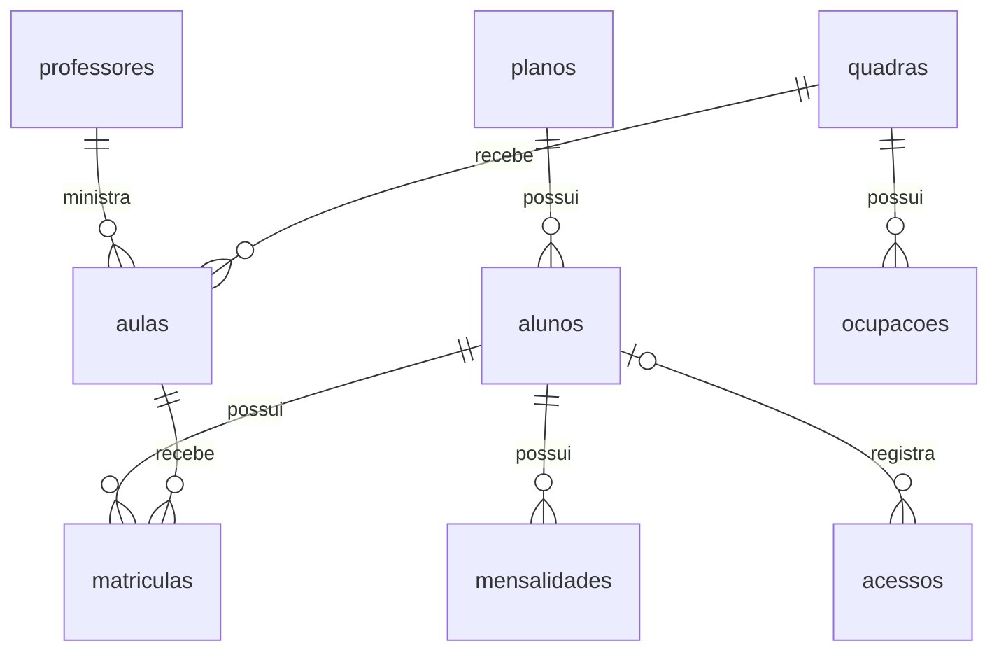

# Modelo de dados

Este documento descreve as tabelas do projeto, seus campos e os relacionamentos entre elas.

## 1. Alunos

A tabela `alunos` guarda o cadastro de cada aluno. Cada linha representa um aluno.

| Campo | Função | Tipo de chave |
|---|---|---|
| id | Identifica o aluno de forma única | Primária |
| nome | Guarda o nome do aluno | Não é chave |
| plano_id | Indica o plano atual do aluno | Estrangeira |
| status | Indica se o cadastro está ativo ou inativo | Não é chave |

O campo `plano_id` aponta para o campo `id` da tabela `planos`.
Vários alunos podem estar vinculados ao mesmo plano.

Inativar um aluno preserva seu cadastro e histórico.
A inadimplência será verificada pelas mensalidades,
separadamente do status do cadastro.

## 2. Planos

A tabela `planos` guarda as opções de plano.
Cada linha representa um plano que pode ser associado a vários alunos.

| Campo | Função | Tipo de chave |
|---|---|---|
| id | Identifica o plano de forma única | Primária |
| nome | Guarda o nome do plano | Não é chave |
| acesso_livre | Indica se permite entrada fora do horário da aula | Não é chave |

Exemplos de planos:

| id | nome | acesso_livre |
|---|---|---|
| 1 | Sócio Acesso Livre | Sim |
| 2 | Plano Aluno | Não |

A permissão de acesso livre não dispensa a exigência de cadastro ativo e pagamento em dia.

## 3. Professores

A tabela `professores` guarda o cadastro dos professores.
Cada linha representa um professor.

| Campo | Função | Tipo de chave |
|---|---|---|
| id | Identifica o professor de forma única | Primária |
| nome | Guarda o nome do professor | Não é chave |
| modalidade | Informa a modalidade que ele ensina | Não é chave |

Neste projeto, cada professor ensina uma modalidade e pode ministrar várias aulas.

O vínculo será feito pelo campo `professor_id` da tabela `aulas`, apontando para `professores.id`.

## 4. Quadras

A tabela `quadras` guarda o cadastro das quadras da arena.
Cada linha representa uma quadra.

| Campo | Função | Tipo de chave |
|---|---|---|
| id | Identifica a quadra de forma única | Primária |
| numero | Guarda o número usado para identificar a quadra na arena | Não é chave estrangeira; deve ser único |

O campo `quadra_id` das tabelas `aulas` e `ocupacoes` aponta para `quadras.id`.

A disponibilidade será calculada considerando as aulas e as ocupações no período consultado.
Não será armazenada como um status fixo nesta tabela.

## 5. Aulas

A tabela `aulas` guarda os horários semanais das aulas.
Cada linha representa uma aula recorrente em um dia da semana, com professor e quadra definidos.

| Campo | Função | Tipo de chave |
|---|---|---|
| id | Identifica a aula de forma única | Primária |
| professor_id | Indica o professor responsável | Estrangeira |
| quadra_id | Indica a quadra utilizada | Estrangeira |
| dia_semana | Informa o dia semanal da aula | Não é chave |
| horario_inicio | Guarda o horário de início | Não é chave |
| duracao_minutos | Guarda a duração em minutos | Não é chave |

O campo `professor_id` aponta para `professores.id`.
O campo `quadra_id` aponta para `quadras.id`.

Uma aula às segundas e outra às quartas serão registradas em linhas diferentes, com IDs diferentes, 
mesmo que tenham o mesmo professor, quadra e horário.

O término será calculado somando a duração ao horário de início. A duração deverá ser maior que zero.

Os alunos participantes serão vinculados pela tabela `matriculas`.

## 6. Matrículas

A tabela `matriculas` registra os vínculos entre alunos e aulas. Cada linha representa a participação de um aluno em uma aula semanal.

| Campo | Função | Tipo de chave |
|---|---|---|
| id | Identifica o vínculo de forma única | Primária |
| aluno_id | Indica o aluno participante | Estrangeira |
| aula_id | Indica a aula da qual ele participa | Estrangeira |

O campo `aluno_id` aponta para `alunos.id`.
O campo `aula_id` aponta para `aulas.id`.

Um aluno pode participar de várias aulas.
Uma aula pode ter vários alunos.

O mesmo par de aluno e aula não poderá ser cadastrado duas vezes, evitando vínculos duplicados.

Professor, quadra e horário serão consultados na tabela `aulas`, sem repetir esses dados aqui.

## 7. Mensalidades

A tabela `mensalidades` registra as cobranças mensais
dos alunos. Cada linha representa uma mensalidade
de um aluno em determinado mês e ano.

| Campo | Função | Tipo de chave |
|---|---|---|
| id | Identifica a mensalidade de forma única | Primária |
| aluno_id | Indica o aluno responsável | Estrangeira |
| mes_referencia | Guarda o mês da cobrança, de 1 a 12 | Não é chave |
| ano_referencia | Guarda o ano da cobrança | Não é chave |
| data_vencimento | Informa a data limite para pagamento | Não é chave |
| data_pagamento | Registra a data em que foi paga | Não é chave |

O campo `aluno_id` aponta para `alunos.id`.
Um aluno pode ter várias mensalidades.

Enquanto a mensalidade não estiver paga,
`data_pagamento` ficará sem valor, representado por NULL.

Uma mensalidade estará atrasada quando a data
de vencimento tiver passado e não houver pagamento
registrado.

O registro do pagamento será feito manualmente.
O projeto não processará pagamentos.

## 8. Ocupações

A tabela `ocupacoes` registra eventos, manutenções
e usos por Day Use. Cada linha representa uma ocupação
de uma quadra em um período específico.

| Campo | Função | Tipo de chave |
|---|---|---|
| id | Identifica a ocupação de forma única | Primária |
| quadra_id | Indica a quadra ocupada | Estrangeira |
| motivo | Informa se é evento, manutenção ou Day Use | Não é chave |
| inicio | Guarda a data e a hora de início | Não é chave |
| fim | Guarda a data e a hora de término | Não é chave |

O campo `quadra_id` aponta para `quadras.id`.
Uma quadra pode ter várias ocupações em períodos diferentes.

Eventos e manutenções terão início e fim definidos.
O fim deverá ser posterior ao início.

No Day Use, o início será registrado na chegada.
O campo `fim` ficará como NULL enquanto o uso estiver
em andamento e será preenchido na liberação da quadra.

As aulas semanais permanecerão na tabela `aulas`.
A consulta de disponibilidade considerará tanto as aulas
quanto os registros de `ocupacoes`.

## 9. Acessos

A tabela `acessos` guarda o histórico de tentativas de entrada. Cada linha representa uma tentativa,
permitida ou negada.

| Campo | Função | Tipo de chave |
|---|---|---|
| id | Identifica a tentativa de forma única | Primária |
| aluno_id | Indica o aluno que tentou entrar | Estrangeira |
| data_hora | Registra a data e a hora da tentativa | Não é chave |
| status | Informa se o acesso foi permitido ou negado | Não é chave |
| motivo | Registra a explicação da decisão | Não é chave |

O campo `aluno_id` aponta para `alunos.id`.
Um aluno pode ter várias tentativas de entrada.

Em uma tentativa sem cadastro, `aluno_id` será NULL, pois não existe um aluno cadastrado para vincular.
O resultado será negado, com o motivo correspondente.

O histórico preservará o resultado e o motivo registrados no momento de cada tentativa.

Uma entrada permitida não garante a disponibilidade de uma quadra. Essa disponibilidade será consultada separadamente.

## 10. Relacionamentos entre as tabelas

Cada relacionamento é implementado por uma chave estrangeira:

| Campo de origem | Campo referenciado |
|---|---|
| alunos.plano_id | planos.id |
| aulas.professor_id | professores.id |
| aulas.quadra_id | quadras.id |
| matriculas.aluno_id | alunos.id |
| matriculas.aula_id | aulas.id |
| mensalidades.aluno_id | alunos.id |
| ocupacoes.quadra_id | quadras.id |
| acessos.aluno_id | alunos.id |

Um aluno pode participar de várias aulas, e uma aula
pode ter vários alunos. A tabela `matriculas` representa
esse relacionamento de muitos para muitos.

Uma tentativa de acesso pode estar vinculada a um aluno
ou não ter aluno vinculado, quando não existe cadastro.
